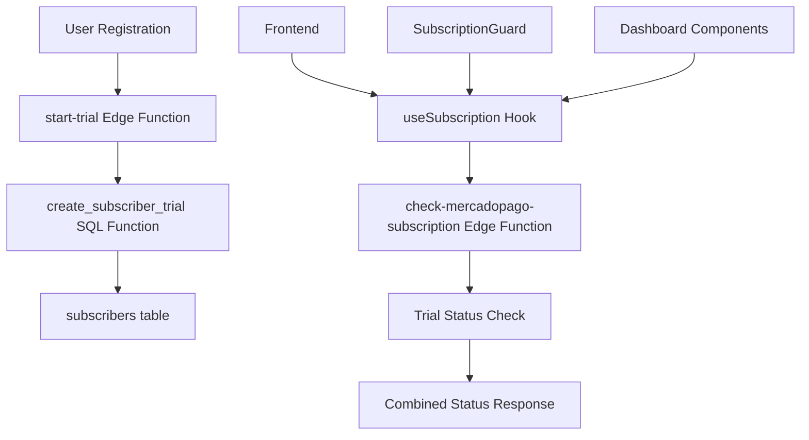

# Design Document

## Overview

O sistema de período de teste de 7 dias será implementado como uma extensão do sistema de assinatura existente. A arquitetura aproveitará a infraestrutura atual do MercadoPago e Supabase, integrando-se com os componentes `SubscriptionGuard`, `useSubscription` hook, e as Edge Functions existentes.

O design foca em três aspectos principais:

1. **Criação automática de trials** para novos usuários
2. **Verificação integrada** de status de trial junto com assinaturas pagas
3. **Interface visual** para mostrar status e dias restantes do trial

## Architecture

### Backend Architecture



### Data Flow

1. **Trial Creation Flow:**

   - Novo usuário se registra → `start-trial` Edge Function é chamada
   - Função verifica se usuário já tem trial → Se não, cria registro com 7 dias
   - Dados são salvos na tabela `subscribers` com `subscription_tier = "Trial"`

2. **Access Verification Flow:**

   - Componente protegido carrega → `useSubscription` hook executa
   - Hook chama `check-mercadopago-subscription` → Função verifica trial ativo E assinatura paga
   - Retorna status combinado → `SubscriptionGuard` permite/bloqueia acesso

3. **Trial Status Display Flow:**
   - Dashboard carrega → Hook fornece dados de trial
   - Componente calcula dias restantes → Exibe indicador visual apropriado

## Components and Interfaces

### 1. Backend Components

#### Enhanced start-trial Edge Function

```typescript
interface TrialCreationRequest {
  // Sem body necessário - usa token de autenticação
}

interface TrialCreationResponse {
  message: string;
  trial_created: boolean;
  trial_already_exists: boolean;
  subscribed: boolean;
  subscription_tier: string;
  trial_start: string;
  trial_end: string;
  trial_days_remaining: number;
}
```

#### Enhanced check-mercadopago-subscription Edge Function

```typescript
interface SubscriptionCheckResponse {
  subscribed: boolean;
  subscription_tier: string | null;
  trial_start: string | null;
  trial_end: string | null;
  trial_days_remaining: number | null;
  trial_active: boolean;
  has_paid_subscription: boolean;
  access_level: "none" | "trial" | "premium";
}
```

#### Database Schema Enhancement

```sql
-- Existing subscribers table with trial columns
ALTER TABLE subscribers ADD COLUMN IF NOT EXISTS trial_active BOOLEAN DEFAULT false;

-- New function for trial status calculation
CREATE OR REPLACE FUNCTION calculate_trial_status(user_id UUID)
RETURNS TABLE (
  trial_active BOOLEAN,
  days_remaining INTEGER,
  access_level TEXT
);
```

### 2. Frontend Components

#### Enhanced useSubscription Hook

```typescript
interface TrialData {
  trial_active: boolean;
  trial_start: string | null;
  trial_end: string | null;
  trial_days_remaining: number | null;
}

interface EnhancedSubscriptionData extends SubscriptionData {
  trial_data: TrialData;
  access_level: "none" | "trial" | "premium";
  effective_subscription: boolean; // trial ativo OU assinatura paga
}
```

#### New TrialStatusBanner Component

```typescript
interface TrialStatusBannerProps {
  trialData: TrialData;
  onUpgrade: () => void;
}

// Exibe banner no topo do dashboard com:
// - Dias restantes do trial
// - Botão de upgrade
// - Cores diferentes baseado em dias restantes (verde > amarelo > vermelho)
```

#### Enhanced SubscriptionGuard Component

```typescript
// Lógica atualizada para considerar trials ativos:
const hasAccess = isAdmin || subscriptionData.effective_subscription;

// Hierarquia de acesso:
// 1. Admin (acesso total)
// 2. Assinatura paga ativa (acesso total)
// 3. Trial ativo (acesso total)
// 4. Sem acesso (redirect para perfil)
```

### 3. Integration Points

#### Auto-Trial Creation

- **Trigger:** Primeiro login após registro
- **Location:** `useAuth` hook ou `ProtectedRoute` component
- **Logic:** Verificar se usuário tem subscriber record, se não, chamar `start-trial`

#### Trial Expiration Handling

- **Check:** A cada verificação de subscription
- **Action:** Se trial expirado e sem assinatura paga, bloquear acesso
- **UI:** Modal de upgrade automático

## Data Models

### Enhanced Subscribers Table

```sql
CREATE TABLE subscribers (
  id UUID PRIMARY KEY DEFAULT gen_random_uuid(),
  user_id UUID REFERENCES auth.users(id) ON DELETE CASCADE,
  email TEXT UNIQUE NOT NULL,

  -- Subscription fields (existing)
  stripe_customer_id TEXT,
  subscribed BOOLEAN DEFAULT false,
  subscription_tier TEXT,
  subscription_start TIMESTAMPTZ,
  subscription_end TIMESTAMPTZ,

  -- Trial fields (existing + enhanced)
  trial_start TIMESTAMPTZ,
  trial_end TIMESTAMPTZ,
  trial_active BOOLEAN GENERATED ALWAYS AS (
    trial_end IS NOT NULL AND trial_end > NOW()
  ) STORED,

  -- Payment fields (existing)
  payment_method JSONB,
  last_payment_amount INTEGER,
  last_payment_status TEXT,

  -- Metadata
  created_at TIMESTAMPTZ DEFAULT NOW(),
  updated_at TIMESTAMPTZ DEFAULT NOW()
);
```

### Trial Status Calculation

```sql
-- Function to calculate comprehensive trial status
CREATE OR REPLACE FUNCTION get_user_access_status(check_user_id UUID)
RETURNS TABLE (
  has_paid_subscription BOOLEAN,
  trial_active BOOLEAN,
  trial_days_remaining INTEGER,
  access_level TEXT,
  effective_subscription BOOLEAN
) AS $$
BEGIN
  RETURN QUERY
  SELECT
    COALESCE(s.subscribed, false) as has_paid_subscription,
    COALESCE(s.trial_end > NOW(), false) as trial_active,
    CASE
      WHEN s.trial_end > NOW() THEN
        CEIL(EXTRACT(epoch FROM (s.trial_end - NOW())) / 86400)::INTEGER
      ELSE 0
    END as trial_days_remaining,
    CASE
      WHEN COALESCE(s.subscribed, false) THEN 'premium'
      WHEN COALESCE(s.trial_end > NOW(), false) THEN 'trial'
      ELSE 'none'
    END as access_level,
    COALESCE(s.subscribed, false) OR COALESCE(s.trial_end > NOW(), false) as effective_subscription
  FROM subscribers s
  WHERE s.user_id = check_user_id;
END;
$$ LANGUAGE plpgsql SECURITY DEFINER;
```

## Error Handling

### Trial Creation Errors

1. **User already has trial:** Return existing trial info, don't create new
2. **Database error:** Log error, return graceful failure message
3. **Authentication error:** Return 401 with clear message

### Trial Verification Errors

1. **Network timeout:** Use cached data if available, fallback to no access
2. **Database unavailable:** Graceful degradation, allow basic access
3. **Invalid trial data:** Auto-correct inconsistencies, log for review

### Frontend Error States

1. **Loading states:** Show skeleton loaders during verification
2. **Error boundaries:** Catch subscription check failures
3. **Retry mechanisms:** Auto-retry failed subscription checks

## Testing Strategy

### Unit Tests

1. **Trial calculation functions:** Test edge cases (expired, future dates, null values)
2. **Access level determination:** Test all combinations of trial/subscription states
3. **Date calculations:** Test timezone handling and daylight savings

### Integration Tests

1. **Trial creation flow:** End-to-end user registration → trial creation
2. **Access verification:** Test protected routes with different subscription states
3. **Trial expiration:** Test behavior when trial expires during session

### Edge Function Tests

1. **start-trial function:** Test with new users, existing users, invalid tokens
2. **check-subscription function:** Test trial + subscription combinations
3. **Error scenarios:** Test network failures, database timeouts

### Frontend Tests

1. **SubscriptionGuard:** Test access control with different states
2. **useSubscription hook:** Test data fetching and state management
3. **TrialStatusBanner:** Test visual states and user interactions

### Manual Testing Scenarios

1. **New user journey:** Registration → automatic trial → dashboard access
2. **Trial expiration:** User with expiring trial → upgrade flow
3. **Subscription upgrade:** Trial user → paid subscription → continued access
4. **Edge cases:** Admin users, users with corrupted data, network issues
